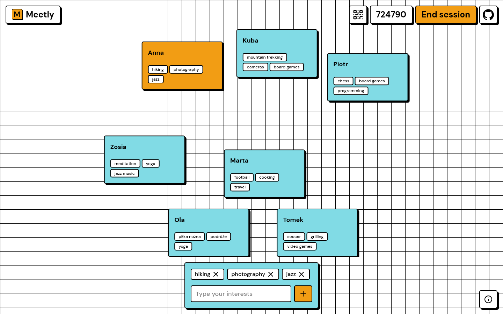

# Meetly

A web app that helps people in one room find each other. A host starts a session, guests join with a 6-digit code or a QR code, and everyone types in their interests. People are shown as cards on a live graph, and the cards of people with similar interests are pulled together.



## Features

- **Host** – creates a session and shows its code and QR code, then joins it like everyone else.
- **Join** – enter the code on the main page or scan the QR code (it opens `/?code=<code>`).
- **Invite** – during a session, click the code in the header to copy the invitation link, or open the QR code again.
- **Interests** – pick a name and add your interests. You can add or remove them at any time, but you need at least one. Every change is sent to everyone in the session right away.
- **Graph** – each person is a card, linked to others by how well their interests match (see [Matching](#matching)). Linked cards pull together, and you can drag them. Your card is highlighted and inactive people are greyed out.
- **Leave or end** – guests can leave a session. The host can end it for everyone.
- **Your sessions** – sessions you joined are saved in the browser and listed on the main page while they still exist, so you can go back to them.

## Matching

Interests are matched by meaning, not spelling, so "football" and "soccer", count as the same interest. The backend embeds every interest with the multilingual [paraphrase-multilingual-MiniLM-L12-v2](https://huggingface.co/Xenova/paraphrase-multilingual-MiniLM-L12-v2) model (run locally with [Transformers.js](https://huggingface.co/docs/transformers.js), quantized to 8 bits) and compares them with cosine similarity.

The strength of the link between two people:

1. For each interest of person A, take the most similar interest of person B.
2. Similarities below `0.6` count as 0. Similarities above it are rescaled to 0–1.
3. Sum these over all of A's interests. Do the same from B to A and take the average.

People with a strength of 0 are not linked.

## Sessions

Sessions are kept in memory on the backend, so they are lost when it restarts.

- A session lasts at most 1 hour.
- A session with nobody connected ends after 5 minutes.
- A person who disconnects is shown as inactive, and their card is removed after 5 minutes unless they come back.
- Only the host can end a session. The backend gives the host a token when the session is created, and the frontend keeps it in `localStorage`.

## File structure

- `backend/` – NestJS API run with Bun.
  - `src/main.ts` – entry point: CORS and the WebSocket adapter.
  - `src/common/config.ts` – port and allowed CORS origin, read from the environment.
  - `src/session/handlers/session.controller.ts` – REST endpoints for creating, checking and ending sessions.
  - `src/session/handlers/session.gateway.ts` – WebSocket gateway: joining, leaving, answers and broadcasting the session state.
  - `src/session/services/session.service.ts` – sessions, their timeouts and the link strengths.
  - `src/session/services/embedding.service.ts` – the embedding model and similarity.
  - `src/health/` – `GET /health`.
- `frontend/` – React app built with Vite and Tailwind CSS.
  - `src/App.tsx` – the views and navigation between them.
  - `src/views/` – `Home`, `Host`, `Guest` and `Answers` (the graph).
  - `src/components/LinkedGraph.tsx` and `src/utils/simulateForces.ts` – the graph and its force simulation.
  - `src/hooks/useWebSocket.ts` – connection to the session.
  - `src/lib/` – API client and `localStorage` helpers.
  - `src/components/ui/` – [neobrutalism.dev](https://www.neobrutalism.dev/) components (shadcn/ui on Base UI).

## Usage

Copy the example environment file first:

```sh
cp .env.example .env
```

| Variable       | Used by  | Description                                    |
| -------------- | -------- | ---------------------------------------------- |
| `PORT`         | backend  | Port of the API (default `8080`).              |
| `CORS_ORIGIN`  | backend  | URL of the frontend allowed to call the API.   |
| `VITE_API_URL` | frontend | URL of the API.                                |
| `VITE_URL`     | frontend | URL of the frontend, used in invitation links. |

### Docker Compose

```sh
docker compose up
```

The frontend runs on http://localhost:5173 and the backend on http://localhost:8080. Both reload on changes.
